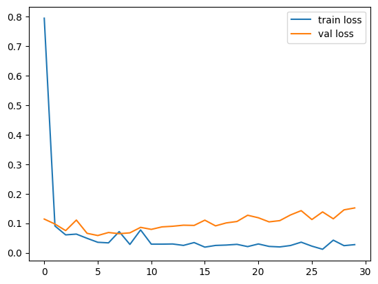
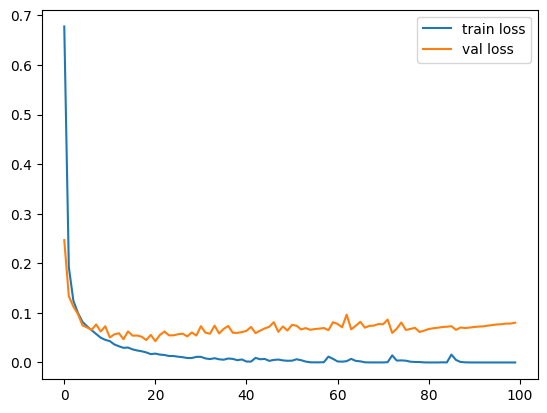

## First Attempt - Custom Convolutional Neural Network

* Epochs: `30`
* Learning Rate: `0.01`
* Optimizer: `Adam`
* Loss: `CrossEntropyLoss`
* Scheduler: `None`

Achieved test accuracy of `0.96825` with the following model:

```py
class CustomModel(nn.Module):

    def __init__(self, indims, numcl):
        super().__init__()
        self.conv1 = nn.Conv2d(1, 64, 3)
        self.conv2 = nn.Conv2d(64, 128, 3)
        self.conv3 = nn.Conv2d(128, 256, 3)

        self.pool = nn.MaxPool2d(2, stride=1) # let's keep it stride of 1 for simple calculations eh

        self.fc1 = nn.Linear(256 * 19 * 19, 100)
        self.fc2 = nn.Linear(100, numcl)

    def forward(self, x):
        x = x.reshape(x.size(0), -1, 28, 28)
        v = F.relu(self.pool(self.conv1(x)))
        v = F.relu(self.pool(self.conv2(v)))
        v = F.relu(self.pool(self.conv3(v)))

        v = v.view(-1, 256*19*19)
        v = F.relu(self.fc1(v))
        v = self.fc2(v)

        return v
```



## Second Attempt - LeNet with ReLU Activation

* Epochs: `100`
* Learning Rate: `1e-3`
* Optimizer: `Adam`
* Loss: `CrossEntropyLoss`
* Scheduler: `ReduceLROnPlateau, patience = 20`

Achieved test accuracy of `0.98764` with the following model:

```py
class LeNetModel(nn.Module):

    def __init__(self, indims, numcl):
        super().__init__()
        self.conv1 = nn.Conv2d(1, 6, kernel_size=5, stride=1)
        self.conv2 = nn.Conv2d(6, 16, kernel_size=5, stride=1)

        self.pool = nn.AvgPool2d(kernel_size=2)

        self.fc1 = nn.Linear(16 * 4 * 4, 120)
        self.fc2 = nn.Linear(120, 84)
        self.fc3 = nn.Linear(84, numcl)

    def forward(self, x):
        x = x.reshape(x.size(0), -1, 28, 28)
        v = self.pool(F.relu(self.conv1(x)))
        v = self.pool(F.relu(self.conv2(v)))

        v = v.view(-1, 16*4*4)
        v = F.relu(self.fc1(v))
        v = F.relu(self.fc2(v))
        v = self.fc3(v)

        return v
```

